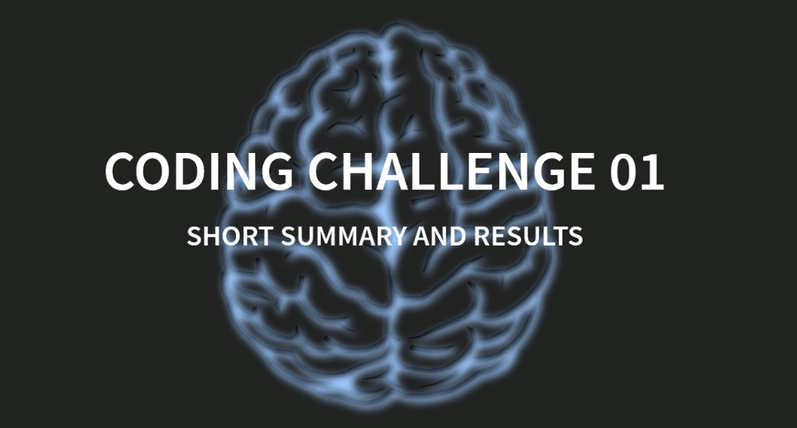
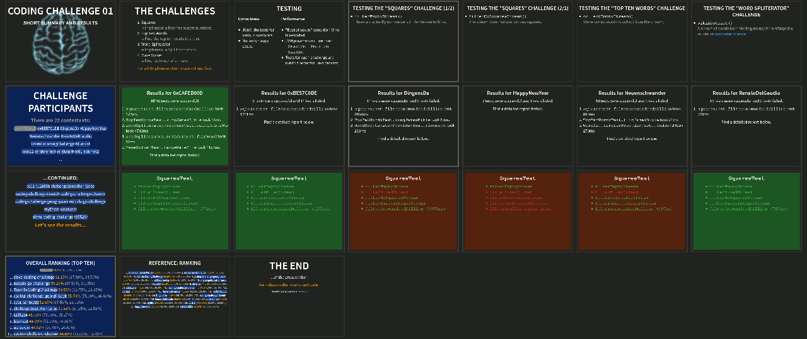

# Coding Challenge I: Java 8

This is a coding challenge I created in 2015. With great support of the management at [my current company](https://www.ubs.com/) we ran the challenge for my developer colleagues. It was fun, and intellectually entertaining - and made for good discussions, too!

I've put this here on GitHub so people can enjoy the educational value of the coding challenge. I am currently working on a [successor challenge](https://github.com/smurf667/cc2-polyglot) (the link will only work once the contents have been published).

The challenge has two parts:
1. the API project, also containing a Maven archetype - see [`coding-challenge`](coding-challenge/README.md), and
1. the evaluation project generating the report - see [`coding-challenger`](coding-challenger/README.md).

Additionally, my solutions to the challenges are [included](0xCAFED00D/README.md). Don't spoil your fun by looking at them prematurely...

To get started, build the `coding-challenge` as described, and generate a project for your contribution.

To test your contribution, build the `coding-challenger` and run it, including your `.jar` file.
Out comes a nice HTML-based report that is built using [RevealJS](https://revealjs.com/).

Here are some sample screenshots:

*Enjoy!*
